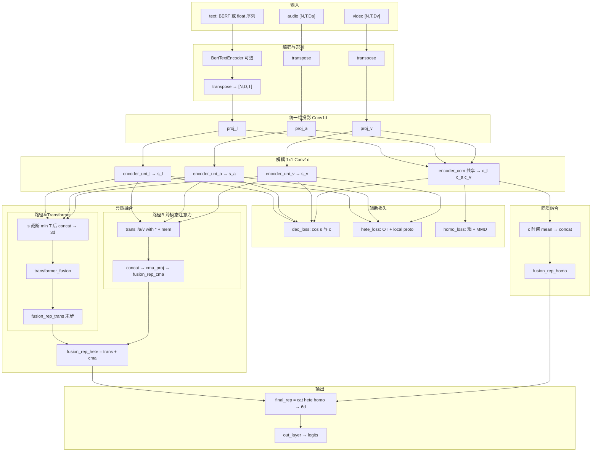
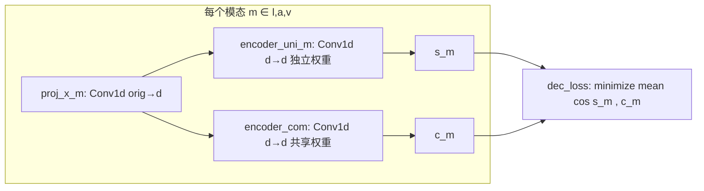
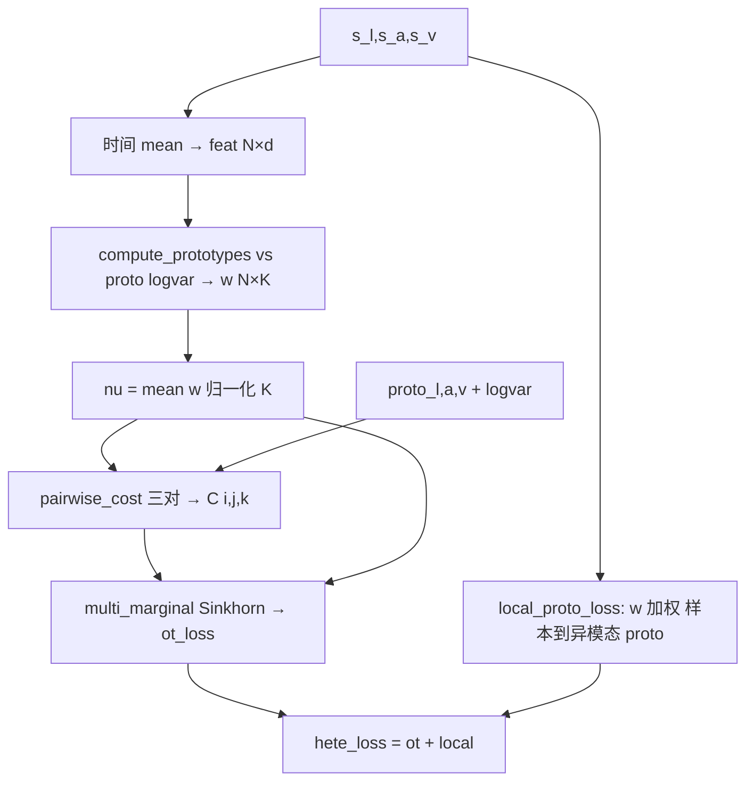
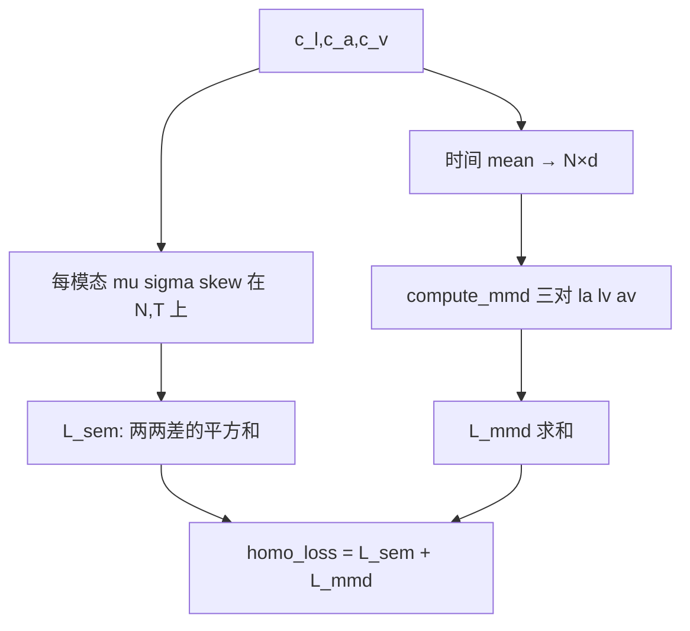
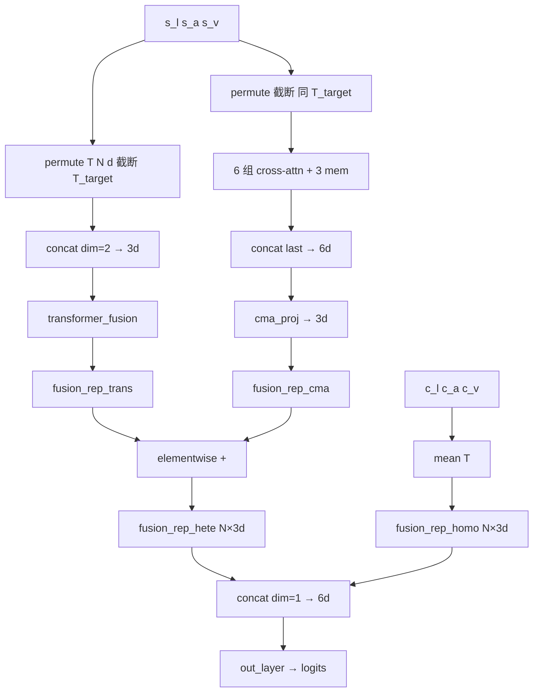

# DecAlign 模型架构与对齐实现细节

本文汇总 **`DecAlign/models/model.py`** 中的**解耦、异质对齐、同质对齐、融合与输出**的实现细节，并附 **Mermaid** 架构图，便于对照代码与论文。

**相关文档**：[DecAlign-implementation.md](./DecAlign-implementation.md)（入口、配置、数据与训练循环）；[DecAlign-hyperparameters.md](./DecAlign-hyperparameters.md)（`model.yaml` 中 DecAlign 相关超参选取与调参顺序）。

---

## 1. 解耦：同质 / 异质分支在代码里是什么

**不是**「编码后各自多层 MLP」，而是：三模态先 **`Conv1d` 投影**到统一维 **`d`**，再：

| 分支 | 模块 | 参数是否跨模态共享 | 数学含义 |
|------|------|-------------------|----------|
| **异质 `s_l,s_a,s_v`** | `encoder_uni_l` / `encoder_uni_a` / `encoder_uni_v` | **否**（三套 `Conv1d(d,d,k=1)`） | 每个模态独有的逐点线性变换 |
| **同质 `c_l,c_a,c_v`** | **`encoder_com`（同一模块）** | **是** | 同一组权重分别作用在 `proj_x_l/proj_x_a/proj_x_v` 上 |

`kernel_size=1` 的 `Conv1d` 在 **`[N,d,T]`** 上**不混合时间步**，只在通道维做 **`d→d`** 线性映射；等价于对每个时间步做一次 **共享权重的 `Linear(d,d)`**，与「多层 MLP（含非线性）」不同：**此处无激活，单层线性**。

**解耦损失 `dec_loss`**：`compute_decoupling_loss` 将 **`s`** 与 **`c`** 展平后算 **余弦相似度**，训练时**最小化**三模态该量的和，鼓励 **unique 与 common 分离**。

---

## 2. 卷积层与「MLP」的区分（实现语境）

- **单层 `Conv1d` / `Linear`（无激活）**：对输入是**（仿射）线性**变换。
- **MLP**：通常指 **`Linear → ReLU/GELU → Linear → …`**，**非线性来自激活函数**，不是来自「叫 MLP」本身。
- **本模型中的 1×1 卷积**：属于**逐点线性**，便于在 **`[N,d,T]`** 上写；与一层无激活 `Linear` 同类。

---

## 3. 异质对齐实现（`compute_hetero_loss`，作用在 **`s_*`**）

**目标**：在**可学习原型**空间中，让三模态「独有」表示**可运输地对齐**，并加**样本—异模态原型**局部项。

### 3.1 步骤摘要

1. **软分配 `w_* ∈ ℝ^{N×K}`**  
   对 **`s_*`** 时间维 **`mean` → `[N,d]`**，与 **`proto_* ∈ ℝ^{K×d}`** 算平方距离，`softmax(-dist)` 得每个样本对 \(K\) 个原型的权重。  
   （`compute_prototypes`；`logvar_*` 参与下面代价，不直接进 softmax。）

2. **边际 `ν_l, ν_a, ν_v ∈ ℝ^K`**  
   对 batch 在 \(N\) 上 **`w_*`** 取平均再归一化（和为 1）。

3. **两两原型代价 `cost_* ∈ ℝ^{K×K}`**  
   **`pairwise_cost`**：原型均值 **欧氏平方** + **对角方差项**（\(\sigma=\exp(\logvar)\)）。

4. **三阶联合代价 `C ∈ ℝ^{K×K×K}`**  
   \(C[i,j,k] = cost_{la}[i,j] + cost_{lv}[i,k] + cost_{av}[j,k]\)。

5. **多边际 Sinkhorn**  
   `K_tensor = exp(-C/reg)`，交替更新 **`u,v,w`**，使联合 **`T ∝ u⊗v⊗w ⊙ K_tensor`** 与 **`ν_l,ν_a,ν_v`** 一致；  
   **`ot_loss = Σ T·C + 0.001·reg·entropy(T)`**。

6. **局部原型损失**  
   各模态 **`feat_* = s_*`** 时间均值，与**另一模态**的 **`proto`** 加权平方距离（权重为本模态 **`w_*`**），六项（l→a/v，a→l/v，v→l/a）求和。

7. **`hete_loss = ot_loss + local_proto_loss`**

### 3.2 超参对应

- **`num_prototypes`** → \(K\)
- **`lambda_ot`** → `ot_reg`（Sinkhorn 核 **`exp(-C/reg)`**）
- **`ot_num_iters`** → Sinkhorn 迭代次数

---

## 4. 同质对齐实现（`compute_homo_loss`，作用在 **`c_*`**）

**目标**：让三模态 **common** 分支在**低阶统计**与**分布距离**上一致。

### 4.1 矩匹配 `L_sem`

对每个 **`c_*`（`[N,d,T]`）** 在 **`(N,T)`** 上算：

- 均值 **`mu`**
- 方差 **`sigma`**
- 偏度 **`skew`**

对 **l/a/v 两两** 的 **`mu`、`sigma`、`skew`** 做 **平方差之和**。

### 4.2 MMD `L_mmd`

- **`c_*`** 时间维 **`mean` → `[N,d]`**。
- 两两模态 **`compute_mmd`**：RBF 核在样本维上构造 **`K_xx, K_yy, K_xy`**，  
  **`MMD = mean(K_xx)+mean(K_yy)-2·mean(K_xy)`**（带宽超参 `kernel_bandwidth=1.0`）。
- **`L_mmd = MMD(l,a)+MMD(l,v)+MMD(a,v)`**。

### 4.3 总同质损失

**`homo_loss = L_sem + L_mmd`**。

---

## 5. 融合与输出（`forward` 后半段）

在 **`s_*`、`c_*`** 与三种 **`loss`** 计算之后：

### 5.1 异质分支 A：Transformer 时序融合

- **`s_*` → `[T,N,d]`**，截断到 **`T_target = min(T_l,T_a,T_v)`**。
- **`concat` → `[T_target,N,3d]`** → **`transformer_fusion`**（`embed_dim=3d`）→ 取**最后时间步** **`fusion_rep_trans`**（**`[N,3d]`**）。

### 5.2 异质分支 B：跨模态注意力（CMA）

- 六组 **`trans_*_with_*`**（query 为一模态，key/value 为另一模态序列）+ **`trans_*_mem`**（3 层）处理拼接输出。
- **`last_h_l, last_h_a, last_h_v`** 拼 **`[N,6d]`** → **`cma_proj`** → **`fusion_rep_cma`**（**`[N,3d]`**）。

### 5.3 同质分支

- **`c_*`** 时间维 **`mean`** → 拼 **`fusion_rep_homo`**（**`[N,3d]`**）。

### 5.4 汇总与预测头

- **`fusion_rep_hete = fusion_rep_trans + fusion_rep_cma`**（逐元素加）。
- **`final_rep = concat(fusion_rep_hete, fusion_rep_homo)`** → **`[N,6d]`**。
- **`out_layer`**：`Linear(6d → 1)`（MOSI/MOSEI）或 **`→ 6`**（IEMOCAP）。

---

## 6. 训练时的损失组合（`trains/ATIO.py`）

```text
loss = main_loss + alpha1 * dec_loss + alpha2 * (hete_loss + homo_loss)
```

- **回归**：`main_loss = L1(logits, labels)`  
- **`alpha1`、`alpha2`**：来自 **`config/dec_config.json`**

验证 / 测试循环里累计的 **loss** 一般为 **主任务 `criterion` only**（不把 `dec/hete/homo` 加进 reported eval loss）。

---

## 7. 张量形状速查（对齐配置 `need_data_aligned=true` 时常见 `T=50`）

| 符号 | 典型形状 | 说明 |
|------|-----------|------|
| `proj_x_*` | `[N, d, T]` | 三模态统一维 `d`（如 40） |
| `s_*, c_*` | `[N, d, T]` | 解耦后 |
| `w_*` | `[N, K]` | 原型软分配 |
| `nu_*` | `[K]` | 批上平均边际 |
| `C` | `[K, K, K]` | 联合代价 |
| `fusion_rep_trans` / `fusion_rep_cma` / `fusion_rep_homo` | `[N, 3d]` | 融合中间量 |
| `final_rep` | `[N, 6d]` | 进 `out_layer` 前 |

---

## 8. 架构总览图（前向 + 损失挂载点）



---

## 9. 解耦子模块细化图



---

## 10. 异质对齐数据流图



---

## 11. 同质对齐数据流图



---

## 12. 异质双路融合与输出图



---

## 13. 源码索引

| 内容 | 文件与符号 |
|------|------------|
| 解耦与投影 | `models/model.py`：`proj_*`、`encoder_uni_*`、`encoder_com` |
| `dec_loss` | `compute_decoupling_loss` |
| 异质 OT | `compute_hetero_loss`、`compute_prototypes`、`pairwise_cost`、`multi_marginal_sinkhorn` |
| 同质对齐 | `compute_homo_loss`、`compute_mmd` |
| 前向融合 | `forward` 步骤 7–7.4 |
| 训练加权 | `trains/ATIO.py`：`DecAlignTrainer.do_train` |

---

## 14. 事件序列仓库集成（`decalign_event.py` / `model.py`）

根目录 **`decalign_event.DecAlignEventFusion`** 将三路 **`[B,S,embed_dim]`**（类型、文本、时间 `tem_emb`）投影到内部维 **`d`**，复用与参考实现同构的 **解耦、`dec/hete/homo`、异质双路（`transformer_fusion` + 六路 CMA + `cma_proj`）**；**同质分支在融合表征上使用沿事件维的因果前缀 mean**（`fusion_rep_homo`），**异质子模块在事件维上使用因果 attention mask**（`decalign_transformer.build_causal_attn_mask`）。

- **配置**：`config/model.yaml` 中 `use_decalign` 及 `lambda_decalign_*`、`decalign_*` 超参；**需** `tem_enc_type: TimePositionEncoding`；`tem_enc` 只前向一次，结果作为 M3，**不再**与 LLM 前 `cat(tem_emb)` 重复。各键含义与调参顺序见 [DecAlign-hyperparameters.md](./DecAlign-hyperparameters.md)。
- **图像**：若 `use_image`，在 DecAlign 输出 **`[B,S,hidden]`** 之后与 `encode_images` 结果 **`cat` 再经 `decalign_img_merge`**。
- **与参考差异**：参考实现 CMA/Trans 取 **末时间步**；本集成对 **每个事件步** 保留 **全长序列输出** 再投影到 LLM 维。`compute_hetero_loss` / `compute_homo_loss` 仍与参考同式（时间维统计未改为严格因果 OT，见代码注释）。

---

*文档生成自 `DecAlign/` 当前实现；若代码变更请以仓库为准。*
